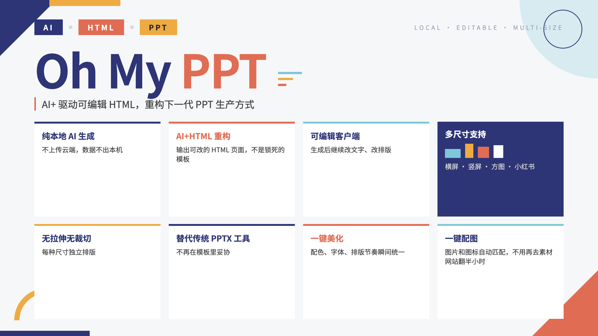
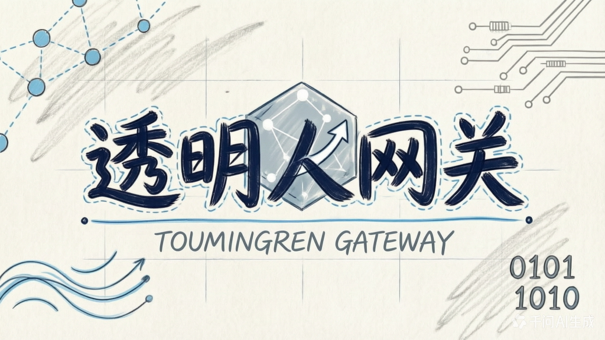
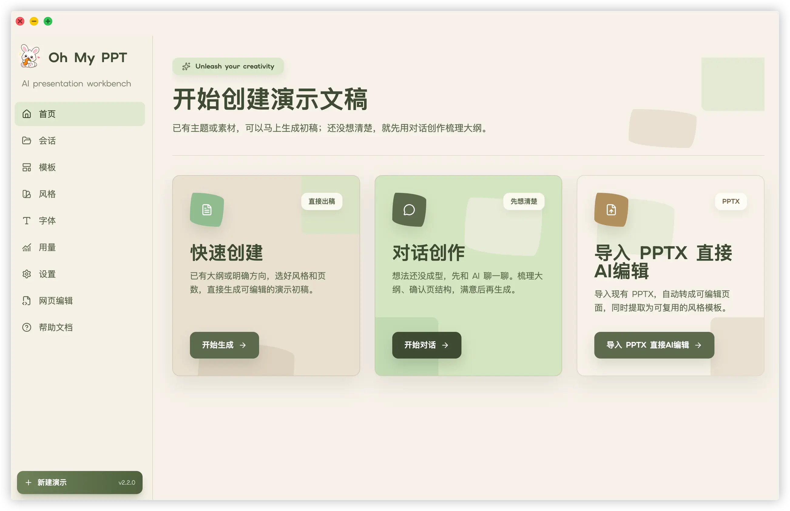
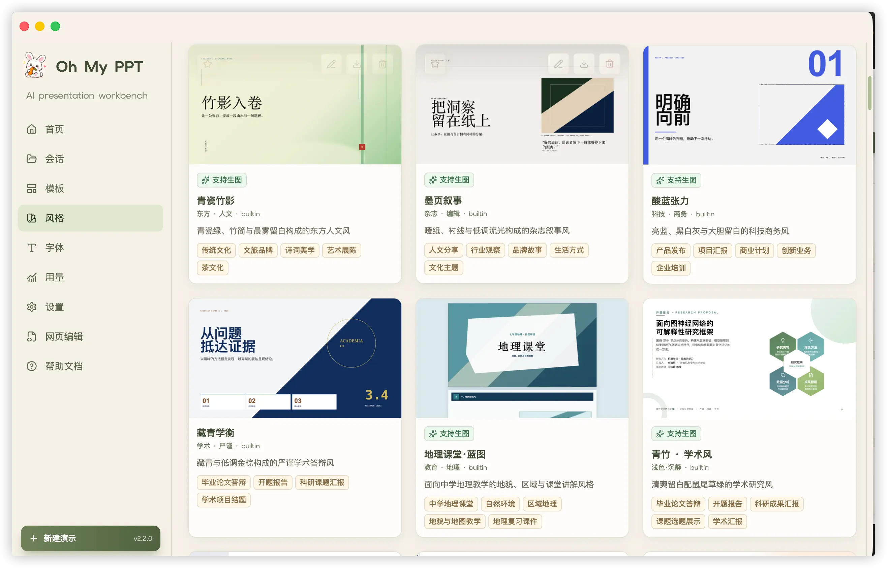
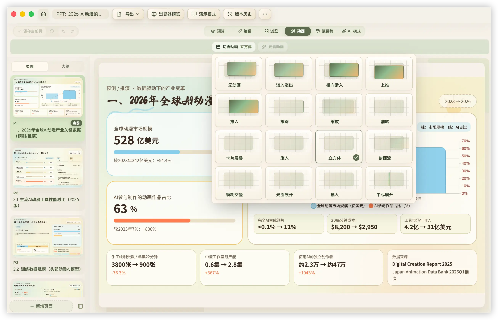
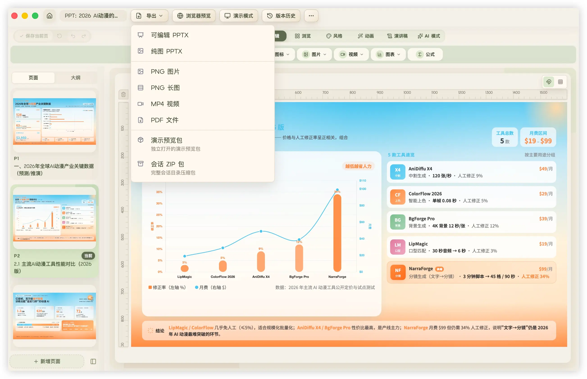

<div align="center">
  
  <br/>
  <br/>


**Oh My PPT - 本地优先的 AI PPT、配图生成与编辑工具**

[English](./README_EN.md) | [为什么做这个](#why) • [能做什么](#features) • [使用流程](#workflow) • [更新日志](./CHANGELOG.md) • [使用问题](#usage-notes)

  <p>
    AI+ 驱动可编辑 HTML，重构下一代 PPT 生产方式。<br/>
    描述你想表达的内容，让 AI 完成大纲、页面与配图。<br/>
    从创作到编辑、演示与导出，都在一套本地优先的工作流中完成。<br/>
    Local-first · Your models, your workflow.
  </p>

   [官网](https://www.ohmyppt.cc) | [下载安装包](https://github.com/arcsin1/oh-my-ppt/releases) ｜ [帮助中心](https://www.ohmyppt.cc/#/help)

   

</div>

---

<a id="sponsors-list"></a>
## 🏢 赞助商

| 赞助商 | 简介 |
| --- | --- |
| <a href="https://www.toumingren.xyz/" target="_blank"></a> | [透明人](https://www.toumingren.xyz/) — 把订阅变成可编程的 API，不做黑盒，只做透明的中间层 |

<a id="sponsors"></a>
## 💖 赞助者

感谢每一位支持过 Oh My PPT 的朋友，完整列表见 [SponsorsList.md](./SponsorsList.md)。

---

## 目录

- [赞助商](#sponsors-list)
- [赞助者](#sponsors)
- [为什么做这个](#why)
- [旧 PPTX 模板导入编辑](#pptx-import)
- [客户端导出可编辑 PPTX](#pptx-export)
- [能做什么](#features)
- [使用流程](#workflow)
- [内置 90+ 风格 Skill](#style-skills)
- [AI 生图与智能配图](#image-generation)
- [字体管理](#fonts)
- [动画支持](#animations)
- [支持本地 Ollama 模型](#ollama)
- [使用问题汇总](#usage-notes)
  - [别忘了填写模型配置](#config)
  - [关于预览模式](#preview)
  - [关于导出](#export)
- [未签名应用打不开的问题(mac已损坏等问题)](#unsigned-app)
- [参考](#references)
- [贡献者](#contributors)
- [License](#license)

---

<a id="why"></a>
## 🎯 为什么做这个

**让 AI HTML PPT 成为可能。**

每次要做分享/汇报/路演/答辩就头疼，光纠结 PPT 排版就占了大半时间。

市面上 AI PPT 工具虽然多，但大多生成的是固定格式文件，想微调样式、加入自己想要的动画演示都很麻烦。

于是自己写了一个 HTML 版 PPT 生成器——初衷只是给自己做个顺手的工具。

生成的是 HTML 版 PPT：打开即预览、无需安装软件、一个浏览器搞定，还能随心改样式/加动效/插代码/导出分享。

<a id="pptx-import"></a>
## 📥 旧 PPTX 模板导入编辑，接近 100% 还原

已有的 PPTX 模板、历史汇报或客户文件，可以直接导入客户端继续编辑。常规 PPTX 导入后可实现接近 **100%** 的视觉与结构还原，并转换为应用内可继续拖拽、调整、AI 修改和版本管理的页面；导入时还会提取原文件风格，供后续创建和复用。

解析与结构化转换均为 Oh My PPT **纯自研**；复杂形状、图表、表格、动画等仍在持续优化，还原度受原文件特性、字体和素材复杂度影响。

<a id="pptx-export"></a>
## 📤 客户端导出为可编辑 PPTX，接近 100% 还原

在客户端完成创作或编辑后，可直接导出为 PowerPoint / Keynote 中继续修改的真实 PPTX。常规场景下，导出文件的视觉与结构还原度接近 **100%**，并尽量保留文字、图片、颜色、公式和基础布局。

HTML 到可编辑 PPTX 的生成与排版均为 **纯自研**；复杂图表、表格、形状和动画仍在持续优化。

<a id="features"></a>
## ✅ 能做什么

- 📥 **旧 PPTX 模板导入编辑，接近 100% 还原** — 导入后转为可拖拽、调整、AI 修改和版本管理的页面；解析与结构化转换纯自研
- 📤 **客户端导出可编辑 PPTX，接近 100% 还原** — 导出为 PowerPoint / Keynote 中可继续编辑的真实 PPTX；生成与排版纯自研
- 💬 **主题创作** — 填写主题、详细描述和页面设置，AI 自动规划大纲、配色与排版，生成完整演示稿
- 🔀 **多任务生成** — 可同时提交多个生成任务并行执行，不用等一个完成再创建下一个，后台生成完成时自动弹出通知
- 📐 **多尺寸 / 多内容格式画布** — 16:9、4:3、竖屏 9:16、竖版 3:4、方图 1:1、小红书图文等格式，从生成到导出全程保留真实比例
- 📄 **从文档创建** — 也支持上传 txt、md、csv、docx 文档，自动整理主题、页数和详细描述，生成时**继续参考原文件内容**，产出贴合原文的创意 PPT
- 🌐 **HTML 编辑** — 导入单个 HTML 文件后可在应用内直接编辑和保存，支持 AI 修改、素材添加、历史管理、预览和导出
- 🧱 **模板库与模板创建** — 可将已生成或已编辑的演示保存为模板，也支持 PPTX 导入为模板，并可复用模板创建新的 PPT 会话
- 🎨️ **图片识别生成风格与大纲** — 支持上传截图/设计稿，自动识别视觉特征并生成独特风格与演示大纲（需使用支持多模态的 AI 模型）
- 🖼️ **AI 生图与智能配图** — 创建时可开启自动配图，AI 会根据当前页内容、版式留白和所选风格按需生成插画、背景与视觉素材；不会为了配图而机械地给每页塞图
- ✨ **编辑页生图工作台** — 可根据当前页标题和大纲生成提示词，指定补充描述与图片尺寸后生图；结果可预览、插入画布或一键设为页面背景
- 🏷️ **支持生图的风格筛选** — 风格库会标识可生图的风格，可筛选后使用与页面视觉方向一致的配图
- 🔒 **本地优先** — 会话、源文档、素材和生成结果保存在自己的电脑；不需要 Oh My PPT 账号或平台云端。调用你配置的 AI / 生图服务时，相关请求会发送给该服务商
- 🔤 **字体管理** — 内置 14 款精选 Google 字体（含中文），支持上传本地字体，创建时可分别指定标题和正文字体，也可交给 AI 自动匹配
- 🎨 **内置 90+ 风格 SKILL** — 极简白、赛博霓虹、包豪斯、日式简约、小红书白… 也支持自定义风格
- ✏️ **对话式修改** — 对着某一页说「标题换个颜色」「加个数据图表」，精准修改不用重做
- 🖱️ **可视化编辑** — 一切可见元素皆可拖拽和调整大小，一切元素皆可检选并让 AI 修改
- 📸 **插入图片和视频** — 编辑模式下直接上传图片和视频到页面，支持从素材库或本地文件添加，也能与 AI 生成图片混用
- 📋 **复制元素** — 一键复制任意元素（文字、图片、视频等），自动偏移并独立可编辑
- ↩️ **撤销和重做** — 编辑过程中随时撤销和重做操作，最后再统一保存为版本记录
- 🗑️ **删除元素** — 支持删除任意元素，也支持快捷键快速删除
- 🖥️ **演示模式** — 一键进入全屏演示播放，键盘左右键或点击切换页面
- 📝 **演讲稿生成** — 支持为整套幻灯片或当前页生成演讲稿，内置正式演讲、轻松对话、叙事风格和自定义风格
- 🎬 **动画演示** — 支持 16+ 种页面切换动画，也支持基于 Anime.js v4 的基础整元素动画
- 🎞️ **单个元素动画设置** — 编辑时可选中文字、图片、图表等单个元素，设置入场、强调或退出效果，并调整自动/点击触发、时长和方向
- 🧮 **数学公式渲染** — 支持常见 LaTeX 公式显示，适合课堂、教学、技术分享等场景
- 📄 **其他格式导出** — 支持 PDF、批量 PNG、PNG 长图和 MP4 视频
- 🏷️ **会话管理** — 会话列表可区分 AI 创建和 PPTX 导入，也支持修改演示稿名称
- 🧩 **更稳的页面生成** — 生成时会按所选画布尺寸与内容高度预算组织页面，减少内容溢出
- 🔄 **历史版本回退** — 自动保存每次修改记录，支持任意版本一键回退，改错了也不怕，随时回到满意的状态
- 📦 **一键打包** — 将 HTML 演示稿打包为单个可执行文件，双击即可打开预览，无需安装任何软件（有浏览器就行）
- 💾 **创意 PPT 导入导出** — 编辑页可一键导出会话生成的创意 PPT，在另一台电脑导入后继续二次编辑，跨设备协作无缝衔接

<p>
  
  
  
</p>


首页支持几种常用入口：

- **主题创作**：填写主题、尺寸格式和详细描述，生成完整演示稿、竖版内容、方图或小红书图文。
- **对话创作**：先通过多轮对话梳理主题、资料、受众、结构和每页重点，适合需求还不够清晰、资料较复杂，或者需要先共同推敲大纲的场景。
- **上传文档解析**：上传 txt、md、csv、docx 等文件，让应用先整理主题、页数和详细描述，生成时继续参考原文件内容。
- **从模板创建**：在模板页选择已保存的模板，可直接复制为可编辑 PPT 会话，也可以输入新主题/大纲或上传文档解析后，沿用模板版式、配色和视觉节奏重新生成内容。

已有旧 PPTX 模板可在首页点击「导入 PPTX」，接近 100% 还原后继续编辑；现有会话也可存入模板库，反复复用同一套结构和视觉风格。

已在「设置」配置并验证生图模型后，创建时可开启「启用生图」，AI 会在真正需要视觉素材的位置按页面内容和风格自动配图；会增加一些生成耗时，关闭后仍可在编辑页手动生图。

生成后可预览、演示，或在编辑页继续拖拽元素、插入图片/视频、对话修改、回退历史版本、生成演讲稿；无论导入还是新建的演示稿，都可导出为接近 100% 还原的可编辑 PPTX。

<a id="style-skills"></a>
## 🎨 内置 90+ 风格 Skill

想制作自己的风格 Skill，可以使用官方风格生成包：[arcsin1/style-generate-skill](https://github.com/arcsin1/style-generate-skill)。它适合把参考设计、配色和排版要求整理成可导入 Oh My PPT 的风格包。


<a id="image-generation"></a>
## 🖼️ AI 生图与智能配图

生图能力分为两个入口，分别适合整套生成和局部补图：

| 使用场景 | 怎么使用 | 结果 |
| --- | --- | --- |
| 创建整套演示稿 | 在「设置 → 生图模型」新增并**验证**模型；创建页勾选「启用配图生成」，选择一个带「支持生图」标识的风格 | AI 仅在合适的视觉位置自动生成插画、背景或视觉元素，并保留文字安全区与风格一致性 |
| 编辑已有页面 | 打开编辑页的生图面板，参考当前页内容生成提示词或自行填写，选择模型和尺寸后生成 | 可预览生成结果，插入画布继续排版，或直接设为当前页背景 |

内置 Provider 包括即梦 3.0 / 4.0、Agnes AI、Seedream、硅基流动、Gemini 及 OpenAI 兼容图片接口；文本模型与生图模型是两套独立配置。生图配置需先在「设置 → 生图模型」通过真实测试，验证成功后才能保存。

生成的图片会归档到当前会话的本地素材目录，可继续编辑、替换、导出或随会话迁移；自动配图不会改变页面尺寸，也不会覆盖手动上传的图片。生图请求会发送到所选 Provider，请遵循其隐私与内容政策。

<a id="fonts"></a>
## 🔤 字体管理

内置 14 款精选 Google 字体（含中文字体），同时支持上传本地 `.woff2` 字体文件，可自定义字体名称、分类（无衬线/衬线/手写/等宽等）、用途（标题/正文）和语言类型（拉丁/CJK）。

创建演示稿时，可以分别指定**标题字体**和**正文字体**，也可以交给 AI 根据演示主题和风格自动匹配最合适的字体组合。导出 PPTX 时，已使用的字体会自动嵌入到文件中，确保在其他电脑上打开时字体显示一致。

<a id="animations"></a>
## 🎬 动画支持

Oh My PPT 的页面是 HTML 幻灯片，支持 16+ 种页面切换动画，并内置本地 **Anime.js v4** 动画运行时。生成或编辑页面时，可以让 AI 为标题、数据卡片、图片、图表容器、步骤模块等整块元素添加演示动画。

除了由 AI 自动添加动画，也可以在编辑模式中直接选中单个元素，为它设置入场、强调或退出效果，并调整自动播放或点击触发、动画时长和进入方向。

动画更偏向真实演讲场景：让内容按讲述节奏逐步出现，而不是一页内容一次性全部铺开。适合汇报、路演、课堂演示和产品讲解。

目前支持这些常用表达：

- **淡入**：模块出现时轻量过渡。
- **位移入场**：从上、下、左、右短距离滑入，适合标题、卡片和列表。
- **缩放强调**：关键数字或结论卡片轻微放大后回落。
- **错峰展示**：多张卡片或多条要点按顺序依次出现。
- **点击逐条出现**：演示时通过点击逐步展开内容，方便按讲述节奏推进。

更推荐使用「整个元素」的动画，而不是把文字拆成很多碎片逐字乱动。这样画面更稳、可读性更好，也更适合导出和二次编辑。动画主要用于引导视线和表达层级，不建议做复杂时间线、高频闪烁、无限循环或大幅抖动。

<p>
  
  
</p>

<a id="ollama"></a>
## 🦙 支持本地 Ollama 模型（OpenAI 兼容）

项目支持通过 **OpenAI 兼容协议** 接入本地 Ollama。

在「设置」页面这样填写即可：

- `provider`: `openai`
- `base_url`: `http://127.0.0.1:11434/v1`
- `model`: 你本地拉取的模型名（例如 `qwen2.5-coder:14b`），建议使用 14B+ 的模型（或云端强模型）
- `api_key`: 任意非空字符串（例如 `ollama`）

说明：

- Ollama 默认不校验 API Key，但应用侧会做「非空」校验，所以不能留空。
- 推荐使用 14B+ 的模型（或云端强模型）接入生成。
- OpenAI 官方端点不会携带非标准的 `thinking` 参数，避免返回 `400 Unknown parameter`；配置其他 OpenAI 兼容 `base_url` 时仍会请求关闭 thinking，避免工具调用等多轮链路丢失 `reasoning_content`。
- Ollama 配置用于文本生成、文档解析和编辑对话；需要生图或自动配图时，请在「设置 → 生图模型」另行配置支持图片生成的 Provider。


<a id="usage-notes"></a>
## 使用问题汇总

<a id="config"></a>
### 别忘了填写模型配置
> 推荐：DeepSeek V4、Kimi、Doubao、Qwen、GLM、MiMo、MiniMax 等国产模型，以及 GPT、Claude 等国外模型。

  在「设置 → 文本模型」页面填写用于创作、解析和编辑的模型配置，否则无法生成演示稿。

  若要使用 AI 生图或自动配图，再到「设置 → 生图模型」添加对应 Provider 的完整 JSON 配置并点击「验证」。验证会实际生成一张测试图片；验证成功后才能保存该生图模型，随后即可在创建页和编辑页中选择使用。

<a id="preview"></a>
### 关于预览模式

支持键盘左右键切换页面；支持演示模式和全屏演示模式，按 ESC 退出演示。

<a id="export"></a>
### 关于导出

目前支持五种导出方式，另可将 HTML 演示稿打包为独立打开的文件：

- **PDF**：适合直接分享、归档和打印。
- **PNG**：一键批量导出所有页面图片，适合插入文档、Notion、公众号或社媒内容。
- **PNG 长图**：将整套页面纵向拼接成一张长图，适合发社媒、聊天分享、长文档预览和移动端阅读。
- **可编辑 PPTX**：纯自研导出底层，常规场景还原度接近 100%，可在 PowerPoint / Keynote 中继续编辑。
- **MP4**：导出为视频文件，适合发布到社媒、发送给客户或在不方便播放 PPT 的场景中使用。
- **HTML 打包文件**：将演示稿和运行资源打包，双击即可在浏览器中打开预览和演示。




<a id="unsigned-app"></a>
## 📦 未签名应用打不开的问题

目前发布包可能还没有进行系统级代码签名，所以 macOS 或 Windows 第一次打开时可能会出现安全提示。这个提示通常不是应用损坏，而是系统对「未签名/未公证应用」的默认拦截。

### macOS

如果 macOS 提示「无法打开」「已损坏」「无法验证开发者」，可以按下面任意一种方式处理。

**方式一：右键打开**

1. 打开「访达」或「应用程序」文件夹。
2. 找到 `OhMyPPT.app`。
3. 右键点击应用，选择「打开」。
4. 在弹窗里再次点击「打开」。

这种方式通常只需要做一次，之后就可以正常双击打开。

**方式二：清除隔离属性**

如果右键打开仍然不行，可以在终端执行：

```bash
xattr -cr /Applications/OhMyPPT.app
```

然后重新打开应用。

如果你把应用放在了其他目录，请把命令里的路径替换成实际路径，例如：

```bash
xattr -cr ~/Downloads/OhMyPPT.app
```

### Windows

Windows 可能会因为安装包未签名而触发 SmartScreen 提示，例如「Windows 已保护你的电脑」。这是未签名应用常见的系统提示。

处理方式：

1. 在提示窗口点击「更多信息」。
2. 确认应用名称是 `OhMyPPT`。
3. 点击「仍要运行」。

如果下载后被浏览器或杀毒软件拦截，可以先确认安装包来自本项目的 GitHub Releases 页面，再选择保留或允许运行。

> 建议只从官方 Release 地址下载安装包，避免使用第三方转存文件。

<a id="references"></a>
## 参考

- [@arcsin1/pptx2json](https://www.npmjs.com/package/@arcsin1/pptx2json) — Oh My PPT 纯自研的可编辑 PPTX 导入底层，用于解析 PPTX 并转换为可继续编辑的结构化真实数据；后续会持续完善复杂形状、图表、表格、动画等还原能力。
- [@arcsin1/html2pptx](https://www.npmjs.com/package/@arcsin1/html2pptx) — Oh My PPT 纯自研的可编辑 PPTX 导出底层，用于将 HTML 转换为可继续编辑的真实 PPTX 文件；后续会持续完善复杂形状、图表、表格、动画等还原能力。
- [arcsin1/style-generate-skill](https://github.com/arcsin1/style-generate-skill) — Oh My PPT 官方风格生成 Skill，用于把参考设计、配色、排版和场景要求整理成可导入应用的风格包。
- [ui-ux-pro-max-skill](https://github.com/nextlevelbuilder/ui-ux-pro-max-skill)
- [html-ppt-skill](https://github.com/lewislulu/html-ppt-skill)

<a id="contributors"></a>
## 贡献者

Thanks to all contributors!

<p>
<a href="https://github.com/m13891290332"></a>
<a href="https://github.com/whisper-xiang"></a>
<a href="https://github.com/Jacobinwwey"></a>
</p>

<a id="license"></a>
## License

This project is licensed under the [Apache License 2.0](LICENSE) © 2026 arcsin1 &lt;zy19931129@gmail.com&gt;.
