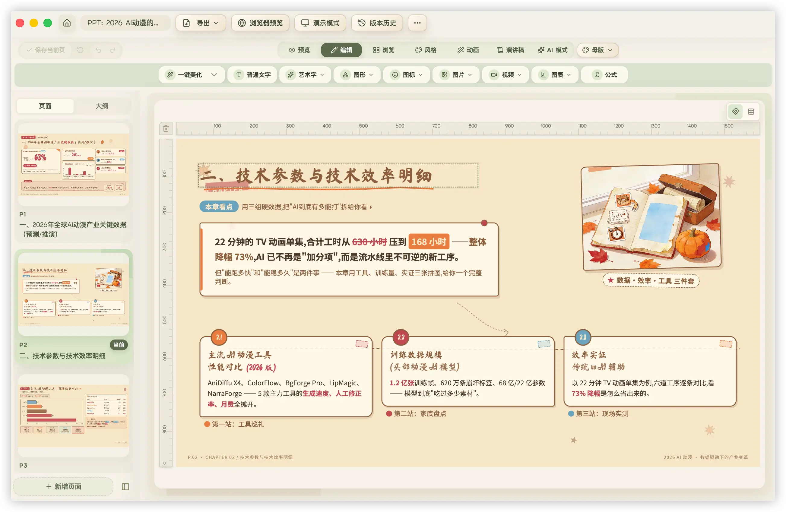

<div align="center">
  
  <br/>
  <br/>


**Oh My PPT - Local-first AI Slide Deck, Image Generation & Editing Workbench**

[中文](./README.md) | [Why](#why) • [Features](#features) • [Workflow](#workflow) • [Changelog](./CHANGELOG.md) • [Usage Notes](#usage-notes)

  <p>
    AI-powered editable HTML, reinventing how next-generation presentations are made.<br/>
    Describe what you want to say and let AI shape the outline, slides, and visuals.<br/>
    Create, edit, present, and export in one local-first workflow.<br/>
    Local-first · Your models, your workflow.
  </p>

  [Website](https://www.ohmyppt.cc) | [Download](https://github.com/arcsin1/oh-my-ppt/releases)

  

</div>

---

## Table of Contents

- [Why I Built This](#why)
- [Import Legacy PPTX Templates for Editing](#pptx-import)
- [Export Editable PPTX from the Desktop App](#pptx-export)
- [What It Can Do](#features)
- [Workflow](#workflow)
- [90+ Built-in Style Skills](#style-skills)
- [AI Image Generation & Smart Visuals](#image-generation)
- [Font Management](#fonts)
- [Animation Support](#animations)
- [Local Ollama Support](#ollama)
- [Usage Notes](#usage-notes)
  - [Configure your models first](#config)
  - [How to add images, videos, and AI visuals to a PPT](#assets)
  - [About preview mode](#preview)
  - [About export](#export)
- [Opening Unsigned Apps](#unsigned-app)
- [Feedback & Requests](#feedback)
- [Sponsor Support](#sponsor)
- [Reference](#references)
- [Sponsors](#sponsors)
- [Contributors](#contributors)
- [License](#license)

---

<a id="why"></a>
## 🎯 Why I Built This

**Making AI-powered HTML presentations possible.**

Every time I needed to prepare a talk, report, pitch, or defense, most of the time went into layout tweaks.

There are many AI PPT tools, but most output fixed-format files. Fine-tuning styles or adding custom animation demos is still painful.

So I built my own HTML-based PPT generator, originally as a personal tool.

Output is pure HTML slides: instant browser preview, no extra software, easy to tweak styles, add motion, embed code, and export to PDF / PNG / editable PPTX.

<a id="pptx-import"></a>
## 📥 Import Legacy PPTX Templates for Editing, Close to 100% Fidelity

Bring existing PPTX templates, past reports, or client files into the desktop app and keep editing. Typical PPTX imports restore close to **100%** of the original visual and structural result, converting files into pages you can drag, adjust, modify with AI, and manage through version history. Imported files can also yield reusable styles for future work.

PPTX parsing and conversion to structured editable data are **fully developed in-house** by Oh My PPT. Complex shapes, charts, tables, animations, mixed text, and extreme layouts continue to improve; actual fidelity varies with the source file's PowerPoint features, fonts, and asset complexity.

<a id="pptx-export"></a>
## 📤 Export Editable PPTX from the Desktop App, Close to 100% Fidelity

After creating or editing in the desktop app, export a true PPTX that remains editable in PowerPoint / Keynote. In typical cases, the exported file preserves close to **100%** of its visual and structural result, including text, images, colors, formulas, and basic layout where possible.

HTML-to-editable-PPTX generation and layout handling are **fully developed in-house** by Oh My PPT. Text overlap, mixed text, complex charts, tables, shapes, and animations are still being improved.

<a id="features"></a>
## ✅ What It Can Do

- 📥 **Import legacy PPTX templates for editing, close to 100% fidelity** — Bring existing templates and past files into the desktop app as pages you can drag, adjust, modify with AI, and manage through version history; parsing and structured conversion are fully in-house
- 📤 **Export editable PPTX from the desktop app, close to 100% fidelity** — Export newly created or edited decks as true PPTX files that remain editable in PowerPoint / Keynote; generation and layout are fully in-house, with complex objects still improving
- 💬 **Topic-based creation** — Set the topic, detailed brief, and page options; AI plans the outline, palette, and layout, then generates a complete deck
- 🔀 **Multi-task generation** — Submit multiple generation tasks in parallel without waiting for one to finish before starting another, with automatic notifications on completion
- 📐 **Multi-size, multi-format canvases** — Beyond traditional PPT sizes, create widescreen decks, 4:3 projection slides, vertical 9:16 pages, portrait 3:4 pages, square 1:1 cards, Xiaohongshu/social-note formats, and more, with generation, preview, editing, and export preserving the real aspect ratio
- 📄 **Document-based creation** — Upload txt, md, csv, or docx files to prepare topic, page count, and description automatically, then keep using the source document during generation
- 🧱 **Template library and template creation** — Save generated or edited decks as templates, import PPTX files as templates, and reuse templates to create new PPT sessions
- 🖼️ **Image-based style and outline generation** — Upload a screenshot or design mockup, then automatically extract a distinctive visual style and generate an outline
- 🖼️ **AI image generation and smart visuals** — Enable automatic visuals while creating a deck. AI generates illustrations, backgrounds, and visual assets only where the current content, layout, and chosen style call for them, instead of forcing an image onto every slide
- ✨ **In-editor image studio** — Generate a prompt from the current slide title and outline, add your own direction and image size, then preview the result, add it to the canvas, or make it the slide background
- 🏷️ **Image-generation style filtering** — The style library marks styles that support image generation, so automatic visuals can follow the deck's visual direction
- 🔒 **Local-first** — Sessions, source documents, assets, and generated results stay on your computer. No Oh My PPT account or platform cloud is required. Requests made to your configured AI or image service are sent to that provider
- 🔤 **Font management** — 14 curated Google Fonts built-in (including CJK), upload local fonts, pick title and body fonts separately or let AI auto-match
- 🎨 **90+ built-in style skills** — Minimal White, Cyber Neon, Bauhaus, Japanese Minimal, Xiaohongshu White, and more, plus custom styles
- ✏️ **Chat-based editing** — Tell it “change title color” or “add a data chart” on a specific page, without rebuilding everything  
- 🖱️ **Visual editing** — Every visible element can be dragged and resized, and every element can be picked and modified with AI
- 📸 **Image and video insertion** — Upload images and videos directly in edit mode from the asset library or local files, and use them alongside AI-generated images
- 📋 **Element duplication** — One-click copy of any element (text, images, videos, etc.), auto-offset and independently editable
- ↩️ **Undo and redo** — Undo and redo edits freely before committing, then save as a version history entry
- 🗑️ **Element deletion** — Delete any element with a click or keyboard shortcut
- 🖥️ **Presentation mode** — Enter fullscreen presentation with one click, navigate slides with arrow keys or clicks
- 📝 **Speaker script generation** — Generate scripts for the full deck or the current slide, with formal, casual conversational, storytelling, and custom styles
- 🎬 **Animation support** — 16+ slide transition effects plus Anime.js v4-powered whole-element motion
- 🎞️ **Per-element animation controls** — Select individual text, image, chart, or other elements while editing, then configure entrance, emphasis, or exit effects with automatic/click triggers, duration, and direction
- 🧮 **Math formula rendering** — Display common LaTeX formulas for classes, teaching decks, and technical talks
- 📄 **Other export formats** — Export to PDF, batch PNG, PNG long image, or MP4 video
- 🏷️ **Session management** — Session list distinguishes AI-created decks from imported PPTX decks, and deck names can be renamed
- 🧩 **More reliable page layout** — Generation follows the selected canvas size and content-height budget to reduce overflow
- 🔄 **Version history rollback** — Every edit is automatically saved, roll back to any previous version with one click, never worry about mistakes
- 📦 **One-click packaging** — Bundle your HTML deck into a single executable file, double-click to open and present anywhere, no installation needed (just a browser)
- 💾 **AI-generated creative deck import & export** — Export your AI-generated creative deck from the editing page and import it on another computer to continue editing, making cross-device collaboration seamless


<p>


</p>


<a id="workflow"></a>
## 🔄 Workflow

> 💡 Import a legacy PPTX template to keep editing, or choose a creation mode → confirm topic / materials / page count / canvas format / style / fonts / visuals → AI generates the HTML deck → preview, present, and edit → export an editable PPTX from the desktop app with close to 100% fidelity, PDF / PNG / PNG long image / MP4 / packaged HTML

The home page supports several common entry points:

- **Topic-based creation**: set the topic, canvas format, and detailed brief to create a complete deck, vertical page, square card, or Xiaohongshu/social-note format.
- **Chat to Create**: use a multi-turn conversation to clarify the topic, materials, audience, structure, and key points for each slide. This is useful when requirements are still unclear, the source material is complex, or you want to shape the outline together first.
- **Upload document parsing**: upload txt, md, csv, docx, and other files so the app can prepare the topic, page count, and detailed description, then keep referencing the source file during generation.
- **Create from template**: choose a saved template from the Templates page to copy it into an editable PPT session, or enter a new topic/outline or upload a document so the app regenerates content while preserving the template's layout, palette, and visual rhythm.

Document parsing also checks whether the outline and page count match. For example, if the outline clearly contains five pages, the creation form will try to use five pages too. Your documents stay in the local workspace; the app only prepares them as AI-readable text.

If you already have a legacy PPTX template, click “Import PPTX” on the home page. Typical files are restored to editable in-app pages with close to 100% fidelity, ready for previewing, position adjustments, and chat editing.

Whether you edited an imported template or created a deck in the desktop app, export it from the client as a PPTX that remains editable in PowerPoint / Keynote, with close to 100% fidelity in typical cases.

You can also save an existing session to the template library, or import a PPTX as a template from the Templates page, then reuse the same structure and visual style to create new PPT sessions.

After configuring and verifying an image model in **Settings**, enable **Image Generation** on the creation page. When you choose a style marked **Image generation**, the creation flow will produce visuals where they genuinely improve the page, guided by the page content and the style direction. Automatic visuals add generation time; you can still generate images on demand in the editor when this option is off.

After generation, you can enter preview or presentation mode, keep editing by dragging elements, inserting images/videos, using chat edits, rolling back history, and generate speaker scripts for the full deck or the current slide.

<a id="style-skills"></a>
## 🎨 90+ Built-in Style Skills

To create your own Style Skill, use the official style generation package: [arcsin1/style-generate-skill](https://github.com/arcsin1/style-generate-skill). It helps turn reference designs, palettes, and layout requirements into importable Oh My PPT style packages.


<a id="image-generation"></a>
## 🖼️ AI Image Generation & Smart Visuals

Image generation has two entry points for deck-wide visuals and targeted additions:

| Use case | How to use it | Result |
| --- | --- | --- |
| Create a full deck | Add and **verify** an image model under **Settings → Image Models**, enable **Image Generation** on the creation page, and choose a style marked **Image generation** | AI produces illustrations, backgrounds, or visual elements only in suitable layout slots, preserving text-safe space and the selected visual style |
| Edit an existing slide | Open the editor's image-generation panel, generate a prompt from the current slide or write one yourself, then choose a model and size | Preview the generated image, add it to the canvas for layout work, or set it as the current slide background |

You can configure multiple image services and choose a model while creating or editing. Built-in provider presets currently include Jimeng 3.0 / 4.0, Agnes AI, Seedream, SiliconFlow, Gemini, and OpenAI-compatible image APIs. Available dimensions, speed, cost, and content policies depend on the chosen provider.

Start by running a real test in **Settings → Image Models**. The app generates a test image at the default resolution, and the configuration can only be saved after it returns a visible image. Text models and image models are configured separately: for example, local Ollama can handle text generation, while automatic visuals still need an image-capable provider.

Automatic visuals retain the canvas format you selected and do not replace images you uploaded yourself. Successful outputs are archived in the current session's local asset directory, ready to edit, replace, export, or move with the session. When you submit an image request, its prompt and the necessary page semantics are sent to the image provider you selected; use it in accordance with that provider's privacy and content policies.

<a id="fonts"></a>
## 🔤 Font Management

14 curated Google Fonts are built in (including CJK families). You can also upload local `.woff2` font files and customize the font name, category (sans-serif, serif, handwriting, monospace, and more), role (title / body), and script type (Latin / CJK).

When creating a deck, you can choose **title fonts** and **body fonts** separately, or let AI automatically match the best font pair based on the topic and style. When exporting to PPTX, used fonts are automatically embedded so the deck displays consistently on other computers.


<a id="animations"></a>
## 🎬 Animation Support

Oh My PPT generates HTML slides with 16+ slide transition effects and a local **Anime.js v4** runtime. During generation or chat-based editing, the AI can add presentation motion to whole slide elements such as titles, metric cards, images, chart containers, and step blocks.

In addition to AI-generated motion, edit mode lets you select an individual element and configure its entrance, emphasis, or exit effect, together with automatic or click triggering, duration, and direction.

Animations are designed for real presentation flow: content can appear step by step with the speaker's rhythm instead of showing everything on the slide at once. This works well for reports, pitches, classes, and product walkthroughs.

Common animation expressions include:

- **Fade in**: lightweight transitions when modules appear.
- **Slide-in motion**: short movement from top, bottom, left, or right for titles, cards, and lists.
- **Scale emphasis**: gently enlarge key numbers or conclusion cards, then settle back.
- **Staggered reveal**: reveal cards or bullets one after another.
- **Click-to-reveal**: reveal content step by step during presentation, so the deck follows your speaking pace.

Whole-element animation is preferred over splitting text into many tiny moving fragments. It keeps slides readable, stable, and easier to export or edit later. Animations are meant to guide attention and show hierarchy, so complex timelines, high-frequency flashing, infinite loops, and large shaking motion are not recommended.

<p></>


</p>

<a id="ollama"></a>
## 🦙 Local Ollama Support (OpenAI-Compatible)

This project supports local Ollama through the **OpenAI-compatible API**.

Fill the Settings page like this:

- `provider`: `openai`
- `base_url`: `http://127.0.0.1:11434/v1`
- `model`: your local model tag (for example `qwen2.5-coder:14b`), recommended 14B+ (or a strong cloud model)
- `api_key`: any non-empty string (for example `ollama`)

Notes:

- Ollama does not validate API keys by default, but this app enforces a non-empty check, so `api_key` cannot be blank.
- 14B+ local models (or strong cloud models) are recommended for stable generation quality.
- Official OpenAI endpoints do not receive the non-standard `thinking` parameter, avoiding `400 Unknown parameter` responses. Other OpenAI-compatible `base_url` values still request disabled thinking so multi-turn tool flows do not lose `reasoning_content`.
- The Ollama setup is for text generation, document parsing, and chat editing. Configure an image-capable provider separately under **Settings → Image Models** for image generation or automatic visuals.

<a id="orcarouter"></a>
## 🐋 OrcaRouter Gateway Support

[OrcaRouter](https://www.orcarouter.ai) is an OpenAI-compatible AI gateway that routes to 160+ models from leading providers through one endpoint and one key. It also runs gateway-level, zero-trust security for AI agents on the same endpoint — screening every prompt/response and governing every tool call on a default-deny basis, with no application code changes.

In **Settings → Text Models**, add a model with:

- `provider`: `orcarouter`
- `base_url`: `https://api.orcarouter.ai/v1`
- `model`: any gateway model, for example `orcarouter/auto` (auto-routes to the best model for the request)
- `api_key`: your OrcaRouter key (prefix `sk-orca-`)

The OrcaRouter preset pre-fills the gateway endpoint and the `orcarouter/auto` model alias, and verification runs a real request against `https://api.orcarouter.ai/v1`. Like other OpenAI-compatible `base_url` values, the gateway endpoint is treated as a custom endpoint so compatibility thinking parameters are handled automatically.

<a id="usage-notes"></a>
## Usage Notes

<a id="config"></a>
### Configure your models first

> Recommended: DeepSeek v4, Kimi, Doubao, Qwen, GLM, Xiaomi MiMo, MiniMax, and more Chinese models, plus GPT, Claude, and other international models.

Set up the model for creation, document parsing, and editing under **Settings → Text Models**. Deck generation cannot start without it.

For AI image generation or automatic visuals, add the provider's full JSON configuration under **Settings → Image Models** and select **Verify**. Verification generates a real test image; it must succeed before the configuration can be saved, then it can be selected on the creation page and in the editor.


<a id="assets"></a>
### How to add images, videos, and AI visuals to a PPT

Local images and videos are copied into the current session's local asset directory. In the editor, insert them from the asset library or local files. You can also open the image-generation panel, let AI develop a prompt from the current page or write your own, and then add the result to the canvas or set it as the background.

Oh My PPT does not upload local assets to its own cloud service. However, an image-generation request is sent to the image provider you configured.




<a id="preview"></a>
### About preview mode

Supports keyboard navigation (Left/Right), presentation mode, fullscreen presentation mode, and `ESC` to exit presentation mode.


<a id="export"></a>
### About export

Oh My PPT currently supports five export modes, plus standalone HTML packaging:

- **PDF**: best for sharing, archiving, and printing.
- **PNG**: batch-export every slide as an image for docs, Notion, articles, or social posts.
- **PNG long image**: stitch the full set of pages vertically into one long image for social posts, chat sharing, long-document previews, and mobile reading.
- **Editable PPTX**: export with a fully in-house foundation to a file that remains editable in PowerPoint / Keynote. Typical cases reach close to 100% fidelity while preserving text, images, colors, formulas, and basic layout; text overlap, mixed text, complex charts, tables, shapes, and animations are still being improved.
- **MP4**: export the presentation as a video for social posts, client sharing, or playback when a PPT file is not the best fit.
- **Packaged HTML**: bundle the deck and its runtime resources so it can be opened and presented in a browser with a double click.

<a id="unsigned-app"></a>
## 📦 Opening Unsigned Apps

Release builds may not be code-signed yet, so macOS or Windows can show security warnings on first launch. This usually does not mean the app is broken; it is the operating system blocking unsigned or unnotarized software by default.

### macOS

If macOS says the app cannot be opened, is damaged, or cannot verify the developer, use either option below.

**Option 1: Right-click Open**

1. Open Finder or the Applications folder.
2. Find `OhMyPPT.app`.
3. Right-click the app and choose **Open**.
4. Click **Open** again in the confirmation dialog.

This usually only needs to be done once.

**Option 2: Clear the quarantine attribute**

If right-click Open still does not work, run:

```bash
xattr -cr /Applications/OhMyPPT.app
```

Then open the app again.

If you placed the app somewhere else, replace the path with the actual location, for example:

```bash
xattr -cr ~/Downloads/OhMyPPT.app
```

### Windows

Unsigned installers may trigger Windows SmartScreen, such as “Windows protected your PC”. This is expected for unsigned apps.

Steps:

1. Click **More info**.
2. Confirm the app name is `OhMyPPT`.
3. Click **Run anyway**.

If your browser or antivirus blocks the file, first confirm the installer came from this project’s GitHub Releases page, then choose to keep or allow the file.

> Download builds only from the official Releases page when possible.

<a id="feedback"></a>
## 🙌 Feedback & Requests

If you have new requirements, feature ideas, or bug reports, feel free to open an Issue in this repository or join the feedback groups.
<p>
  <a href="https://discord.gg/FSkzBgsQ"></a>
  &nbsp;&nbsp;|&nbsp;&nbsp;
  <a href="https://arcsin1.github.io/v.png">📱 WeChat group</a>
  &nbsp;&nbsp;|&nbsp;&nbsp;
  <a href="https://arcsin1.github.io/qq.png">💬 QQ group</a>
</p>
I will keep following up and improving the experience.

<a id="sponsor"></a>
## Sponsor Support

Oh My PPT is currently mainly developed and maintained by one person. If it helps you, you can sponsor the project a little (please do not exceed ¥5, and include your GitHub ID in the note). Thank you.

<p>

&nbsp;

</p>

<a id="references"></a>
## Reference

- [@arcsin1/pptx2json](https://www.npmjs.com/package/@arcsin1/pptx2json) — Oh My PPT's fully in-house foundation for editable PPTX import, parsing PPTX files into editable structured data. Support for complex shapes, charts, tables, animations, and more will continue to improve.
- [@arcsin1/html2pptx](https://www.npmjs.com/package/@arcsin1/html2pptx) — Oh My PPT's fully in-house foundation for editable PPTX export, converting HTML into true, editable PPTX files. Support for complex shapes, charts, tables, animations, and more will continue to improve.
- [arcsin1/style-generate-skill](https://github.com/arcsin1/style-generate-skill) — the official Oh My PPT style-generation Skill for turning reference designs, palettes, layouts, and scenario requirements into importable style packages.
- [ui-ux-pro-max-skill](https://github.com/nextlevelbuilder/ui-ux-pro-max-skill)
- [html-ppt-skill](https://github.com/lewislulu/html-ppt-skill)

<a id="sponsors"></a>
## 💖 Sponsors

Special thanks to everyone who has supported this project! Your generosity keeps Oh My PPT alive and growing.

See [SponsorsList.md](./SponsorsList.md) for the full list of sponsors.

<a id="contributors"></a>
## Contributors

Thanks to all contributors!

<p>
<a href="https://github.com/m13891290332"></a>
<a href="https://github.com/whisper-xiang"></a>
<a href="https://github.com/Jacobinwwey"></a>
</p>

<a id="license"></a>
## License

This project is licensed under the [Apache License 2.0](LICENSE) © 2026 arcsin1 &lt;zy19931129@gmail.com&gt;.
